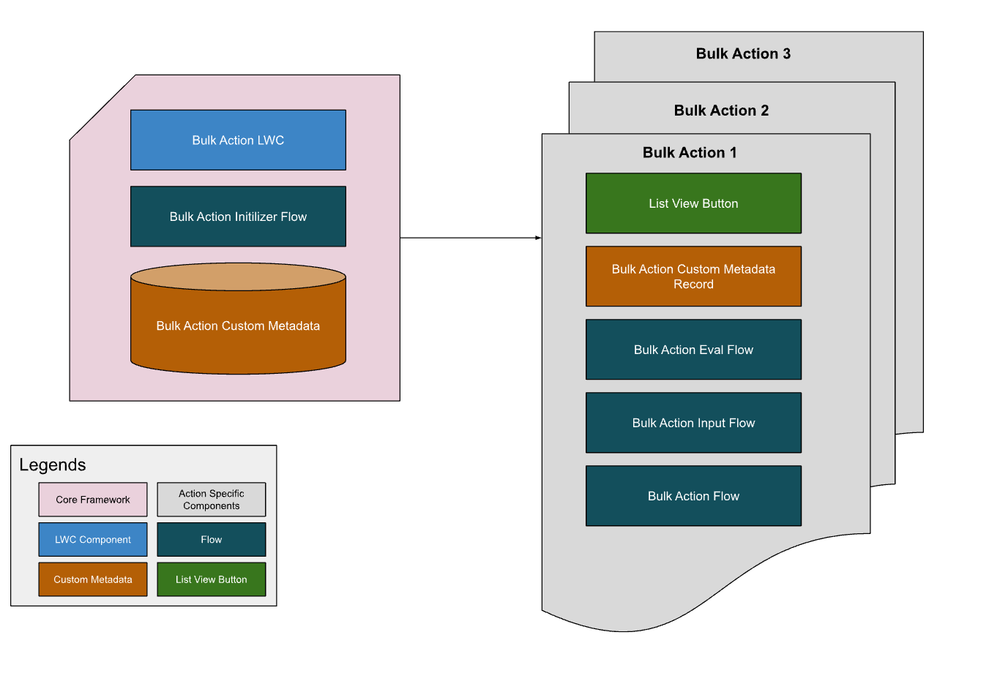

# Bulk Actions Framework

This is not an officially supported Google product. This project is not
eligible for the [Google Open Source Software Vulnerability Rewards
Program](https://bughunters.google.com/open-source-security).

## Overview

The Bulk Actions Framework provides a configurable solution for executing standardized actions on multiple Salesforce records simultaneously. This framework streamlines the development and deployment of bulk operations such as field updates, task creation, and email sending.

## Key Features

- **Efficiency:** Reduces development time for implementing bulk actions.
- **Standardization:** Provides a unified and configurable framework.
- **Flexibility:** Supports custom evaluation criteria, input flows, and action flows.

## Architecture

_High-Level Design_

The framework utilizes a combination of a generic "screen" flow and a Lightning Web Component (LWC). The process is as follows:

1.  **Initiation:** A user triggers a bulk action via a list view button, selecting target records.
1.  **Configuration:** A generic screen flow is invoked, referencing a specific custom metadata configuration.
1.  **Evaluation (Optional):** An evaluation flow filters records based on defined criteria.
1.  **Input (Optional):** An input flow gathers additional user input.
1.  **Execution:** An action flow performs the defined operation on the filtered records.
1.  **Reporting:** A results screen displays the outcome of the bulk action, including successes and errors.

## Implementation

1.  **Installation:** Install the Bulk Actions Framework package into your Salesforce org.
1.  **Flow Development:** Implement custom evaluation, input, and action flows to handle specific business logic.
1.  **Configuration:** Define bulk action configurations using custom metadata, specifying associated flows and preview fields.
1.  **Button Setup:** Add a list view button to the desired object, linking it to the framework's initializer flow.

## Component Breakdown

The framework leverages three types of flows, all configured via custom metadata:

### Evaluation Flow (Optional)

- **Purpose:** Filters records based on specified conditions.
- **Input:** `record` (Data type of records in scope)
- **Output:**
  - `isValid` (Boolean): Indicates if the record meets the criteria.
  - `outputMessage` (Text, Optional): Additional details or messages.

### Input Flow (Optional)

- **Purpose:** Collects user input via a screen flow.
- **Input:** None.
- **Output:** User-defined variables representing gathered input.

### Action Flow (Required)

- **Purpose:** Executes the core action on the filtered records.
- **Input:**
  - `record` (Data type of records in scope): Records to be processed
  - Output Variables from Input Flow (if applicable): Variables used by the action flow.
- **Output:**
  - `errorMessage` (Text, Optional): Error message from flow's fault block.

## Error Handling

The framework handles errors via:

- **Unhandled Exceptions:** Errors not caught within the action flow. These are presented via the `result.getErrors()` output of the action flow.
- **Handled Exceptions (Faults):** Errors handled with a "fault" block in the action flow. `errorMessage` variable is used to surface these types of errors

Both types of errors are displayed on the results screen to the user.

## Setup Wizard

The Bulk Action Setup Wizard simplifies configuration:

1.  **Launch:** Access via the bulk action setup launcher.
1.  **New Configuration:** Create a new configuration.
1.  **Parameter Input:** Enter configuration details through a guided interface.
1.  **Validation:** Input is validated for completeness.
1.  **Final Review:** A summary screen displays the configuration and outlines the required components to create.

_Final Review Screen_
